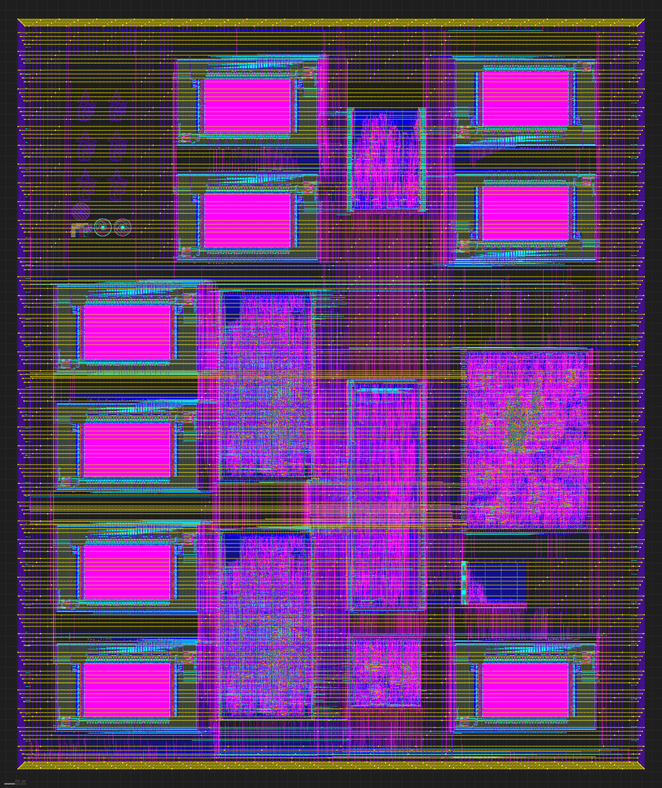

  
<!--  -->

# ExperiarSoC
RISC-V SoC designed for the Efabless Open MPW Program. This project 

## Features
- Dual RV32I cores
- Per core SRAM
- JTAG interface
- External flash controller
- Shared video SRAM
- Configurable VGA output
- 3x UART ports + 1 internal to caravel
- 1x SPI ports
- 4x PWM counters with 4x separate outputs (2 are internal read only)

## Memory Map

## Macro Layout

  
   

## Build Status
- CaravelHost: Success
- ExperiarCore: Success
- Flash: Success
- Peripherals: Success
- Video: Success
- WishboneInterconnect: Success
- user_project_wrapper: Success

# Tests
## RTL
### verify-coreArch-rtl: Success
### verify-corePC-rtl: Success
### verify-coreMemory-rtl: Success
### verify-flash-rtl: Success
### verify-memory-rtl: Success
### verify-peripheralsGPIO-rtl: Success
### verify-peripheralsPWM-rtl: Success
### verify-peripheralsSPI-rtl: Success
### verify-peripheralsUART-rtl: Success
### verify-video-rtl: Success (Not validating correct pixel data)

## GL
### verify-corePC-gl: Success
### verify-coreMemory-rtl: Success
### verify-flash-gl: Success
### verify-memory-gl: Success
### verify-peripheralsGPIO-gl: Success
### verify-peripheralsPWM-gl: Success
### verify-peripheralsSPI-gl: Success
### verify-peripheralsUART-gl: Success
### verify-video-gl: Success

# Roadmap
## Versions
- 0.2.3(Current): Initial MPW-6 design
- 0.3.0: Pipeline CPU
- 0.4.0: Mesh bus
- 0.5.0: Flash/PSRAM controller with caching
- 0.6.0: L1 instruction/data cache and L2 shared cache

## Need to do
- Update probe values
- Add stall signal if two wishbone masters read from the same location at the same time
- Fix some writes not correctly using byte mask
- Fix interrupt cause signals not being gated by mie meaning that the wrong interrupt cause could be set

## Could do
- Misaligned architecture instructions 
- Look into simulation with CVC
- Write macro level simulations to get more coverage due to shorter simulations
- Add JTAG test
- Add interrupt test
- Add uart pin swapping
- Tile map rendering
- Allow JTAG to read from wishbone bus
- Only wait for write if trying to load/store again

# Reference work and inspiration
- [Zero to ASIC Course](https://www.zerotoasiccourse.com/): Complete course on ASIC design. Also has useful references and terminology definitions.
- [Openlane Documentation](https://openlane-docs.readthedocs.io/en/rtd-develop/index.html): Reference for a lot of configuration. The [Variables](https://openlane-docs.readthedocs.io/en/rtd-develop/configuration/README.html) and [Hardening Macros](https://openlane-docs.readthedocs.io/en/rtd-develop/doc/hardening_macros.html#) pages have been particularity useful.
- [Caravel Documentation](https://caravel-harness.readthedocs.io/en/latest/index.html): Reference for caravel and configuration. This seems slightly out of date, but an alternate version can be found in the [github repository](https://github.com/efabless/caravel/tree/main/docs/pdf).
- [Riscduino](https://github.com/dineshannayya/riscduino): Used for inspiration and as a reference for using openlane. There are a number of similar aspects to this project, but all have been reimplemented rather than copied.