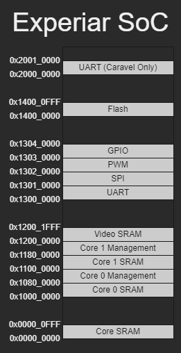

# ExperiarSoC
RISC-V SoC designed for the Efabless Open MPW Program. 

# Features

- Dual RV32I cores
- Per core SRAM
- External flash controller
- Larger shared block SRAM
- VGA output using frame buffer in block SRAM
- 4x UART ports + 1 internal to caravel
- 2x SPI ports
- 4x PWM counters with 4x seperate outputs
- DMA for UART peripheral

# Memory Map

# ToDo
- Flash controller
- DMA
- Block SRAM
- VGA
- Multi core controller
- Fix all of the timeing errors
- Test

# Reference work and inspiration
- [Riscduino](https://github.com/dineshannayya/riscduino): Used for inspiration and as a reference for using openlane. There are a number of similar aspects to this project, but all have been reimplemented rather than copied.
- [Openlane Documentation](https://openlane-docs.readthedocs.io/en/rtd-develop/index.html): Reference for a lot of configuration. The [Variables](https://openlane-docs.readthedocs.io/en/rtd-develop/configuration/README.html) and [Hardening Macros](https://openlane-docs.readthedocs.io/en/rtd-develop/doc/hardening_macros.html#) pages have been particularity useful.
- [Caravel Documentation](https://caravel-harness.readthedocs.io/en/latest/index.html): Reference for caravel and configuration.