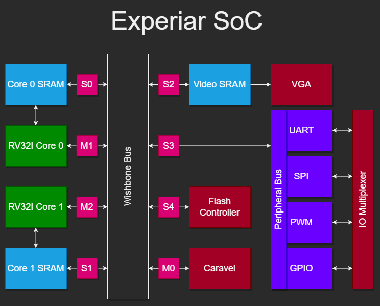
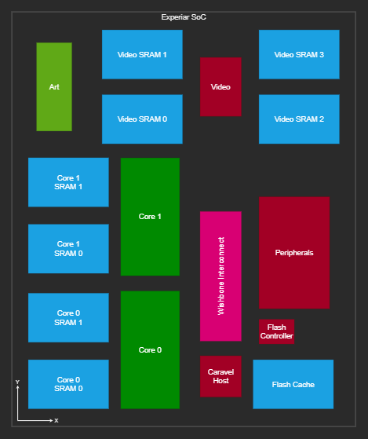

  
<!--  -->

# ExperiarSoC
RISC-V SoC designed for the Efabless Open MPW Program. This project 

## Features
- Dual RV32I cores
- Per core SRAM
- JTAG interface
- External flash controller
- Shared video SRAM
- Configurable VGA output
- 3x UART ports + 1 internal to caravel
- 1x SPI ports
- 4x PWM counters with 4x separate outputs (2 are internal read only)

## Memory Map

## Macro Layout

  
  

## Build Status
- CaravelHost: Success
- ExperiarCore: Success (Seem to be missing much of the core from the gds)
- Flash: Success
- Peripherals: Success
- Video: Success
- WishboneInterconnect: Success
- user_project_wrapper: Success (Max slew violations)

# Tests
## RTL
### verify-peripheralsGPIO-rtl: Success
### verify-peripheralsUART-rtl: Not implemented
### verify-peripheralsSPI-rtl: Not implemented
### verify-peripheralsPWM-rtl: Not implemented
### verify-memory-rtl: Not implemented
### verify-video-rtl: Not implemented
### verify-corePC-rtl: Not implemented
### verify-coreMem-rtl: Not implemented
### verify-coreArch-rtl: Not implemented

## GL
### verify-peripheralsGPIO-gl: Failed
### verify-peripheralsUART-gl: Not implemented
### verify-peripheralsSPI-gl: Not implemented
### verify-peripheralsPWM-gl: Not implemented
### verify-memory-gl: Not implemented
### verify-video-gl: Not implemented
### verify-core-gl: Not implemented

# Need to do
- Write remaining tests (and fix everything until they pass)
- Fix timing violations
- Fix precheck errors

# Could do
- Add gpio registers for set, clear, and toggle which use the write data as a mask
- Add uart pin swapping
- Flash controller
- JTAG core management controller
- CSRs
- More tests
- Tile map rendering 
- Change peripheral bus design to have a read ready signal
- Fetch next instruction a clock cycle earlier so instructions only take 2 cycles

# Reference work and inspiration
- [Zero to ASIC Course](https://www.zerotoasiccourse.com/): Complete course on ASIC design. Also has useful references and terminology definitions.
- [Openlane Documentation](https://openlane-docs.readthedocs.io/en/rtd-develop/index.html): Reference for a lot of configuration. The [Variables](https://openlane-docs.readthedocs.io/en/rtd-develop/configuration/README.html) and [Hardening Macros](https://openlane-docs.readthedocs.io/en/rtd-develop/doc/hardening_macros.html#) pages have been particularity useful.
- [Caravel Documentation](https://caravel-harness.readthedocs.io/en/latest/index.html): Reference for caravel and configuration. This seems slightly out of date, but an alternate version can be found in the [github repository](https://github.com/efabless/caravel/tree/main/docs/pdf).
- [Riscduino](https://github.com/dineshannayya/riscduino): Used for inspiration and as a reference for using openlane. There are a number of similar aspects to this project, but all have been reimplemented rather than copied.